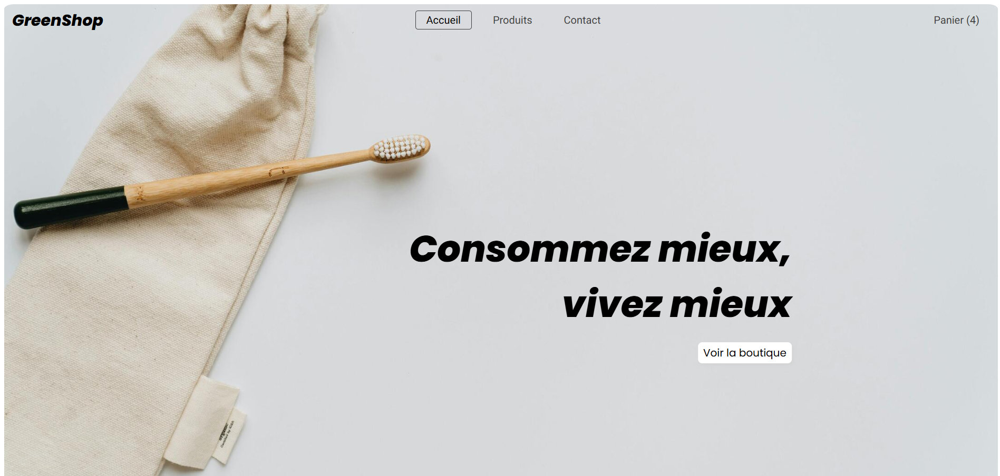
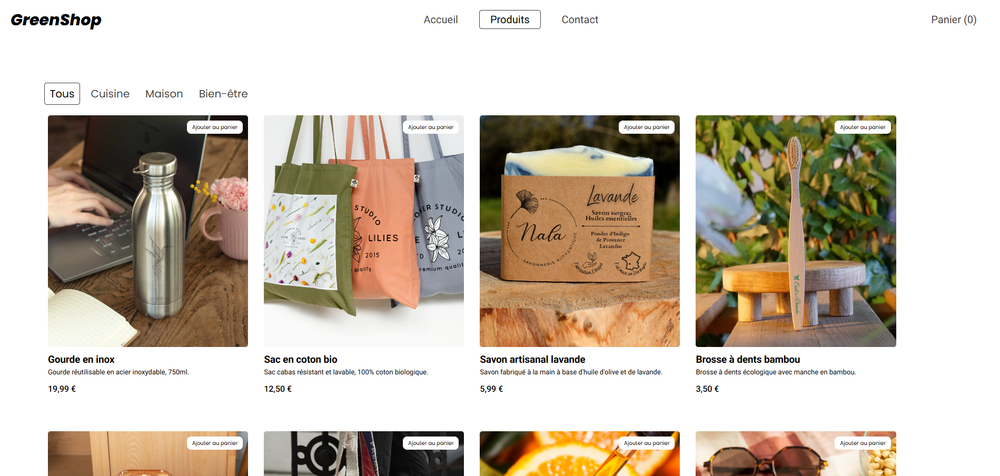
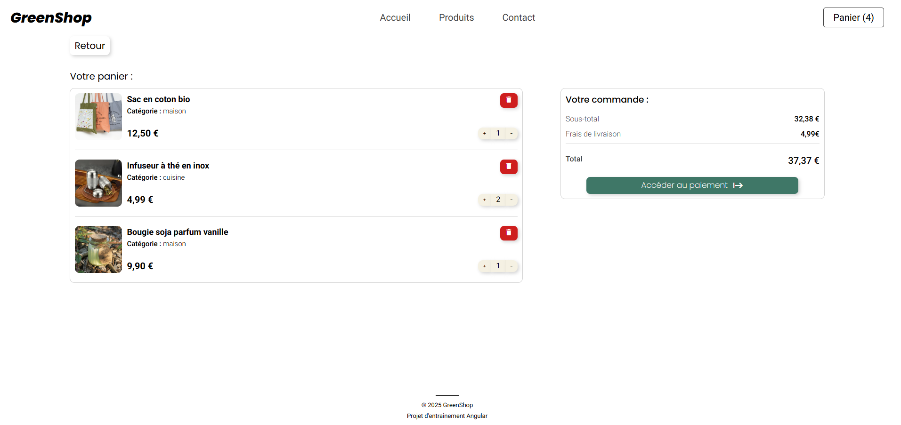
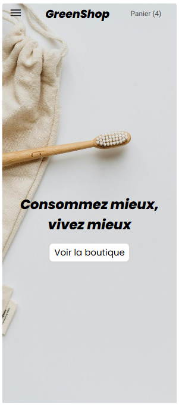
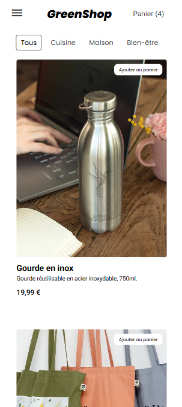
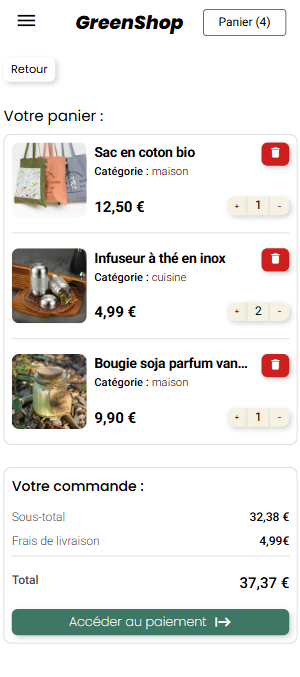

# GreenShop  


GreenShop est une application web fictive que j’ai imaginée et construite pour le plaisir d’apprendre et d’expérimenter. Ce projet personnel m’a permis d'explorer Angular, de tester des idées et de relever de petits défis techniques avec enthousiasme. Même s’il n’est pas destiné à être déployé, il reste un terrain d’expérimentation où j’ai pu créer et donner vie à mes idées.

## 🌐 Démo
Découvrez GreenShop en action :

👉 [Voir l’application](https://green-shop-blue.vercel.app/)  

---

## 📸 Aperçu
#### Desktop




#### Mobile





## ✨ Fonctionnalités  

- 📦 **Catalogue de produits** avec pages détaillées  
- 🛒 **Panier dynamique et réactif** : ajout, modification des quantités et suppression des produits
- 🔎 **Filtres** pour naviguer dans le catalogue  
- 📩 **Page de contact** simple et fonctionnelle  
- 🎲 **Produits mis en avant** de manière aléatoire

---

## ⚡ Installation & Lancement en local 

#### Prérequis
- Node.js (version 22.14.0 ou supérieure recommandée)
- Angular CLI (npm install -g @angular/cli)

<br>

1. **Cloner le projet**  
```bash
git clone https://github.com/WilliamDodart/GreenShop.git
cd greenshop
``` 

2. **Installer les dépendances**
```bash
npm install
``` 

3. **Lancer l’application en mode développement**
```bash
ng serve
``` 

4. **Accéder au projet :**

Ouvrir http://localhost:4200 dans le navigateur.
